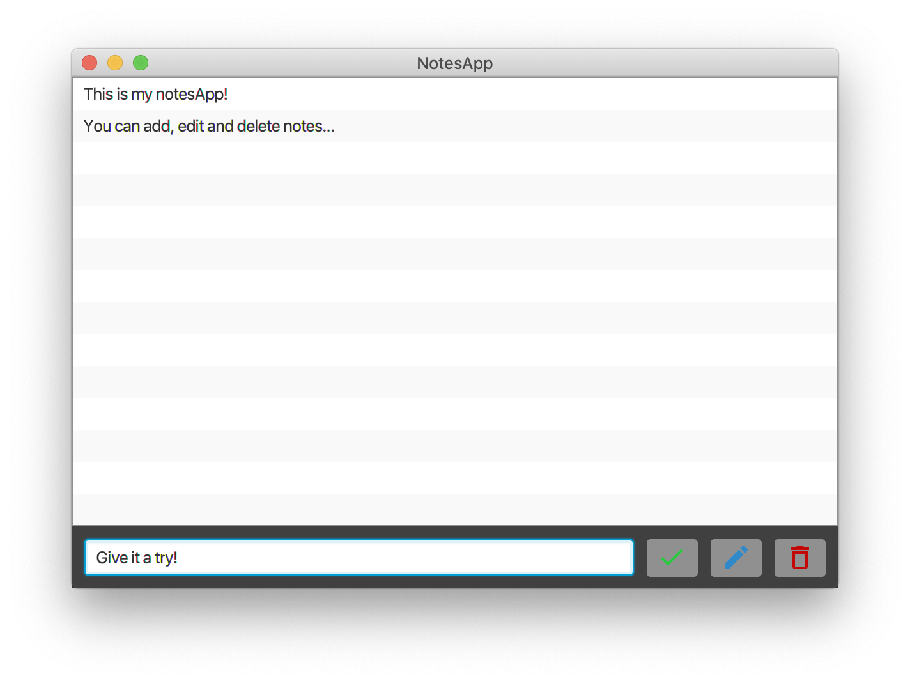

# JavaNotes

This is a simple notes app developed using JavaFX to practice the manipulation of elements and to test out writing data to a file through serialisation.

&nbsp;
## Functionality
To create a new note, simply enter the input into the input panel at the bottom of the app window. Then click the add button with the green tick. 

To edit a note, click on the note to be edited, then type in a new text entry in the field, then click the button with the blue pencil. This will update that field. 

To delete a field, click on the field to be deleted and then click on the button with the red trash can. 



&nbsp;
## Code Features

### Changing Dock Icon
This used to be handled by `com.apple.eawt.Application` but this has since been depreciated. Now it should be
 achieved using the following code snippet, which should be executed as part of the `main()` method on the base class:
 
```java
...
import java.awt.*;
import java.net.URL;
...

   private void start(Stage stage) throws Exception {
      ...
      try {
         setDockImage();
      } catch(Exception e) {
         // handle exception
      };
   }

    private void setDockImage() throws Exception {
       Toolkit dfTools = Toolkit.getDefaultToolkit();
       URL path = Main.class.getClassLoader().getResource("assets/javaNotes_logo.png");
       java.awt.Image image = dfTools.getImage(path);
       java.awt.Taskbar.getTaskbar().setIconImage(image);
    }
...
```

&nbsp;
-------
**Author**

pj1301